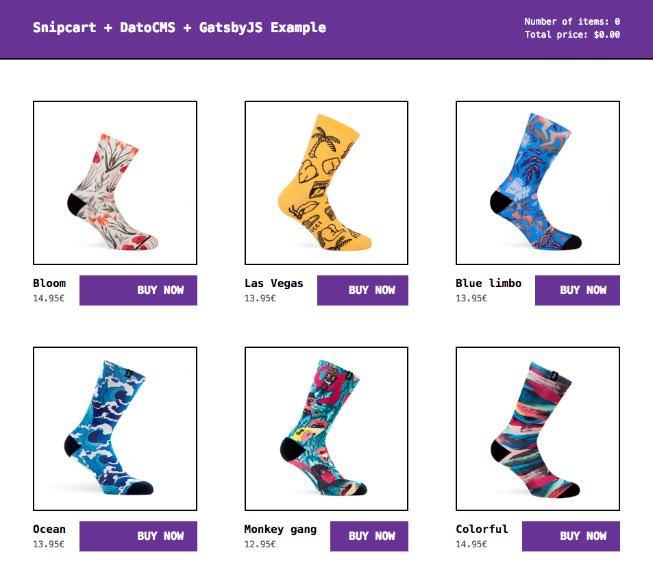

<!--datocms-autoinclude-header start-->
<a href="https://www.datocms.com/"></a>

👉 [Visit the DatoCMS homepage](https://www.datocms.com) or see [What is DatoCMS?](#what-is-datocms)
<!--datocms-autoinclude-header end-->

# Snipcart + Gatsby + DatoCMS example

This is a demo project to get you started with a static ecommerce site powered by [Gatsby](https://www.gatsbyjs.org/), [Snipcart](https://snipcart.com/) and [DatoCMS](https://www.datocms.com/).

It's a brutalist socks ecommerce site, that looks like this:



You can see how it looks live on this [demo installation](https://datocms-snipcart-gatsby-demo.netlify.com/).

All the details on how this works on the [related blog post](https://www.datocms.com/blog/static-ecommerce-website-snipcart-gatsbyjs-datocms).

## Deploy on DatoCMS

If you want to set up a live demo for yourself, just [sign up for a free DatoCMS account](https://dashboard.datocms.com/signup) and click this button:

[](https://dashboard.datocms.com/deploy?repo=datocms/snipcart-gatsby-demo)

## Usage

To run this project locally, install the dependencies of this project:

```
npm install
```

Add an `.env` file containing the read-only API token of your DatoCMS site (set up with the demo button above):

```
echo 'DATO_READONLY_API_KEY=abc123' >> .env
```

Then, to run this website in development mode (with live-reload):

```
npm run develop
```

To build the final, production ready static website:

```
npm run build
```

The final result will be saved in the `public` directory.

## Further demo options

This project is also available as a demo on [Gatsby Cloud](https://www.gatsbyjs.com/). This will allow you to test the [Gatsby preview](https://www.datocms.com/blog/live-preview-changes-on-gatsby-preview) capabilities in no time.

<!--datocms-autoinclude-footer start-->
-----------------
# What is DatoCMS?
<a href="https://www.datocms.com/"></a>

[DatoCMS](https://www.datocms.com/) is the REST & GraphQL Headless CMS for the modern web.

Trusted by over 25,000 enterprise businesses, agency partners, and individuals across the world, DatoCMS users create online content at scale from a central hub and distribute it via API. We ❤️ our [developers](https://www.datocms.com/team/best-cms-for-developers), [content editors](https://www.datocms.com/team/content-creators) and [marketers](https://www.datocms.com/team/cms-digital-marketing)!

**Quick links:**

- ⚡️ Get started with a [free DatoCMS account](https://dashboard.datocms.com/signup)
- 🔖 Go through the [docs](https://www.datocms.com/docs)
- ⚙️ Get [support from us and the community](https://community.datocms.com/)
- 🆕 Stay up to date on new features and fixes on the [changelog](https://www.datocms.com/product-updates)

**Our featured repos:**
- [datocms/react-datocms](https://github.com/datocms/react-datocms): React helper components for images, Structured Text rendering, and more
- [datocms/js-rest-api-clients](https://github.com/datocms/js-rest-api-clients): Node and browser JavaScript clients for updating and administering your content. For frontend fetches, we recommend using our [GraphQL Content Delivery API](https://www.datocms.com/docs/content-delivery-api) instead.
- [datocms/cli](https://github.com/datocms/cli): Command-line interface that includes our [Contentful importer](https://github.com/datocms/cli/tree/main/packages/cli-plugin-contentful) and [Wordpress importer](https://github.com/datocms/cli/tree/main/packages/cli-plugin-wordpress)
- [datocms/plugins](https://github.com/datocms/plugins): Example plugins we've made that extend the editor/admin dashboard
- [DatoCMS Starters](https://www.datocms.com/marketplace/starters) has examples for various Javascript frontend frameworks

Or see [all our public repos](https://github.com/orgs/datocms/repositories?q=&type=public&language=&sort=stargazers)
<!--datocms-autoinclude-footer end-->
